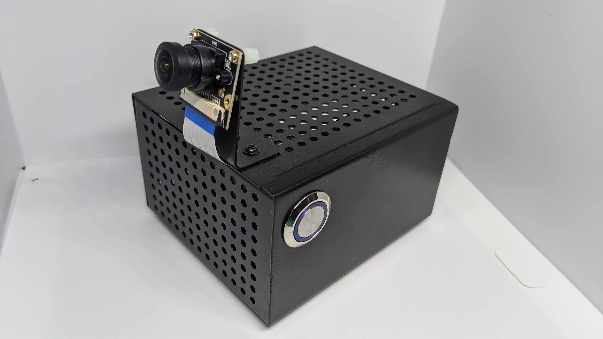

# blog 

## [0. Computer Vision Starter Pack](https://seanavery.github.io/jetson-nano-box/#/)
> gpu powered camera with Jetson Nano and SonyIMX219

## 1. [Real Time Object Detection](https://seanavery.github.io/realtime-ssd-detection/)
> Gstreamer, OpenCV and TensorRT for realtime SSD inference

## 2. [Asynchronous TensorRT Inference](https://github.com/SeanAvery/async-tensorrt)
> multithreaded python application for asynchrounous inference/processing
